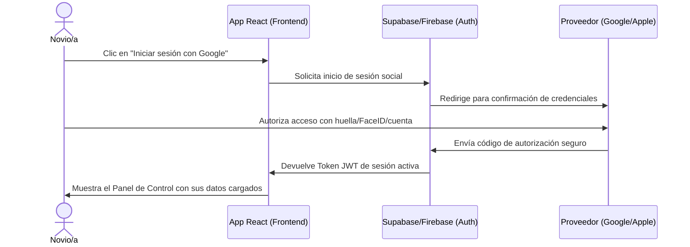

# Guía de Implantación: Integrar el Portal Cosmic Love en WordPress

Esta guía detalla el proceso técnico para integrar el portal de novios (desarrollado en React) dentro de tu sitio web principal alojado en **WordPress**, resolviendo la gestión de usuarios, bases de datos, seguridad e inicio de sesión social (Google y Apple).

---

## 1. ¿Cómo integrar React con WordPress?

WordPress es excelente para marketing, contenido y posicionamiento SEO, pero no está diseñado de forma nativa para albergar aplicaciones interactivas complejas (SPAs) como este portal de novios. 

Existen tres formas principales de realizar la integración:

### Opción A: Despliegue en Subdominio Independiente (Recomendado)
Esta es la **mejor práctica de la industria**. Mantienes tu WordPress en el dominio principal (ej. `cosmiclove.es`) y despliegas la aplicación React en un subdominio dedicado (ej. `portal.cosmiclove.es` o `novios.cosmiclove.es`).
*   **Cómo funciona**: Compilas la aplicación React (`npm run build`) y subes la carpeta `dist` resultante a un servicio de hosting moderno y optimizado como **Vercel** o **Netlify** (que son gratuitos o extremadamente económicos para este volumen, e incluyen SSL automático).
*   **Ventajas**:
    *   **Independencia**: Si actualizas o editas tu WordPress, no hay riesgo de romper la aplicación de los novios, y viceversa.
    *   **Velocidad**: La aplicación React se sirve desde una red de distribución global (CDN), cargando al instante.
    *   **Simplicidad**: El desarrollo y las actualizaciones de código son mucho más fáciles y limpias.

### Opción B: Incrustar mediante Iframe o Bloque HTML
*   **Cómo funciona**: Despliegas la aplicación React de forma independiente (igual que en la Opción A) pero en WordPress creas una página (ej. `cosmiclove.es/portal-novios`) e insertas la aplicación mediante un bloque de `iframe` que ocupe el 100% de la pantalla.
*   **Ventajas**: Los novios no sienten que "salen" de tu dominio principal.
*   **Desventajas**: Puede dar problemas de usabilidad móvil (doble scroll), y dificulta el manejo de cookies o inicios de sesión en navegadores con bloqueadores estrictos (como Safari en iOS).

### Opción C: Integración como Plugin/Shortcode en WordPress
*   **Cómo funciona**: Creas un plugin personalizado en WordPress que encole los archivos compilados Javascript y CSS de React (`wp_enqueue_script` y `wp_enqueue_style`) y los renderice dentro de una página de WordPress a través de un Shortcode (ej. `[cosmic_love_portal]`).
*   **Desventajas**: Requiere envolver React en el ciclo de vida de WordPress, lo que puede provocar conflictos tipográficos, colisiones de estilos CSS y sobrecarga de carga de base de datos en tu servidor web.

---

## 2. Gestión de Usuarios y Seguridad

Actualmente, la aplicación almacena los datos localmente en el navegador (`localStorage`). Para que múltiples parejas puedan registrarse, guardar sus datos en la nube y acceder desde cualquier dispositivo de forma segura, necesitas un **servidor de base de datos (Backend)**.

La solución más recomendada es utilizar un **Backend-as-a-Service (BaaS)** como **Supabase** o **Firebase**, conectando la aplicación directamente a él:

### ¿Por qué Supabase? (Altamente Recomendado)
Supabase es una alternativa de código abierto a Firebase basada en una base de datos relacional **PostgreSQL**, ideal para la estructura de datos de bodas (donde los invitados pertenecen a mesas, las mesas a bodas, etc.).

### Arquitectura de Seguridad
1.  **Aislamiento de Datos (Row Level Security - RLS)**:
    *   En Supabase/Firebase se definen reglas estrictas en la base de datos.
    *   *Ejemplo*: Se añade una regla que dice: *"El usuario A solo puede leer o escribir registros de la tabla 'guests' si el ID de su boda coincide con su ID de usuario autenticado"*. Esto garantiza que ninguna pareja pueda ver los presupuestos, invitados o mesas de otra.
2.  **Tokens Web JSON (JWT)**:
    *   Al iniciar sesión, el usuario obtiene un token firmado digitalmente que expira automáticamente. La app React envía este token en cada consulta para verificar la identidad en milisegundos de forma segura.

---

## 3. Registro e Inicio de Sesión con Google y Apple (OAuth)

Sí, añadir inicio de sesión social es fundamental para maximizar el registro en dispositivos móviles, eliminando la necesidad de recordar contraseñas.

### ¿Cómo se configura?

Tanto Supabase como Firebase proporcionan un sistema de **Autenticación Social (OAuth)** nativo. El flujo de implantación es el siguiente:



1.  **Google Sign-In**:
    *   Creas un proyecto gratuito en **Google Cloud Console**.
    *   Configuras la pantalla de consentimiento de OAuth y obtienes una **ID de Cliente** y una **Clave Secreta**.
    *   Pegas estas claves en la consola de tu proveedor de base de datos (Supabase/Firebase) y configuras la URL de redirección.
2.  **Apple Sign-In**:
    *   Requiere una cuenta en el programa de desarrolladores de Apple (Apple Developer Program, $99/año).
    *   Configuras el servicio *Sign in with Apple* en la sección de certificados e identificadores de Apple, asociando tu dominio.
    *   Configuras la clave privada en tu base de datos.
3.  **Implementación en la App**:
    *   En React, la autenticación social se activa con una sola línea de código:
    ```javascript
    // Ejemplo con Supabase
    const { data, error } = await supabase.auth.signInWithOAuth({
      provider: 'google', // o 'apple'
      options: {
        redirectTo: 'https://portal.cosmiclove.es'
      }
    });
    ```

---

## 4. Hoja de Ruta para la Implantación

Si quieres llevar este prototipo a producción en tu web de WordPress, este es el plan de trabajo recomendado:

### Paso 1: Configuración de la Base de Datos (1-2 días)
*   Crear una cuenta en Supabase.
*   Crear las tablas de la base de datos mapeando los datos de la app:
    *   `couples` (ID, nombre_novio_1, nombre_novio_2, fecha_boda, presupuesto_total)
    *   `guests` (ID, id_boda, nombre, estatus, mesa, menu_infantil, dieta)
    *   `budget_items` (ID, id_boda, categoria, concepto, estimado, real, pagado)
    *   `events` (ID, id_boda, titulo, fecha, hora, descripcion, categoria, completado)

### Paso 2: Integrar el SDK en React (2-3 días)
*   Instalar el cliente de Supabase (`npm install @supabase/supabase-js`).
*   Reemplazar las llamadas de `localStorage` en `App.jsx` por consultas API de Supabase.
*   *Ejemplo de guardado*:
    ```javascript
    // Guardar evento en la nube en vez de localStorage
    const { data, error } = await supabase
      .from('events')
      .insert([newEvent]);
    ```

### Paso 3: Crear la Pantalla de Login / Registro (2 días)
*   Desarrollar una pantalla inicial en la aplicación React con un diseño editorial premium (siguiendo la estética de Cosmic Love) que ofrezca:
    *   Registro/Login con email y contraseña.
    *   Botón de *"Acceder con Google"*.
    *   Botón de *"Acceder con Apple"*.

### Paso 4: Despliegue de React y Enlace en WordPress (1 día)
*   Desplegar la SPA de React en **Vercel** o **Netlify** apuntando a `portal.cosmiclove.es`.
*   En tu WordPress (`cosmiclove.es`), añadir un botón premium en el menú de navegación principal que diga: **"Acceso Novios"** o **"Mi Portal"** que redirija a `portal.cosmiclove.es`.
*   *(Opcional)*: Puedes añadir un plugin de registro simple en WordPress para captar leads y redirigirlos automáticamente al portal una vez se registran en la web.
